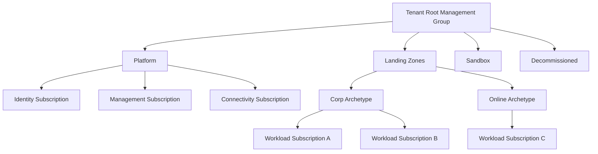
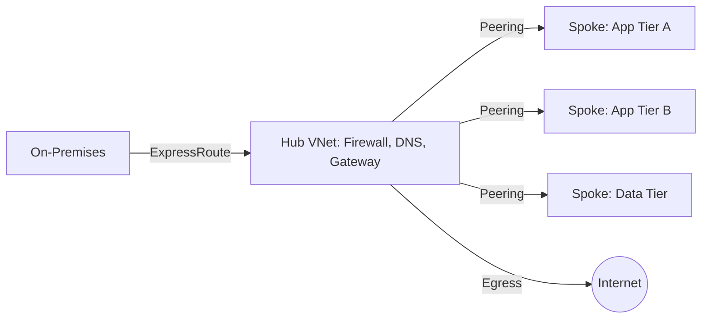
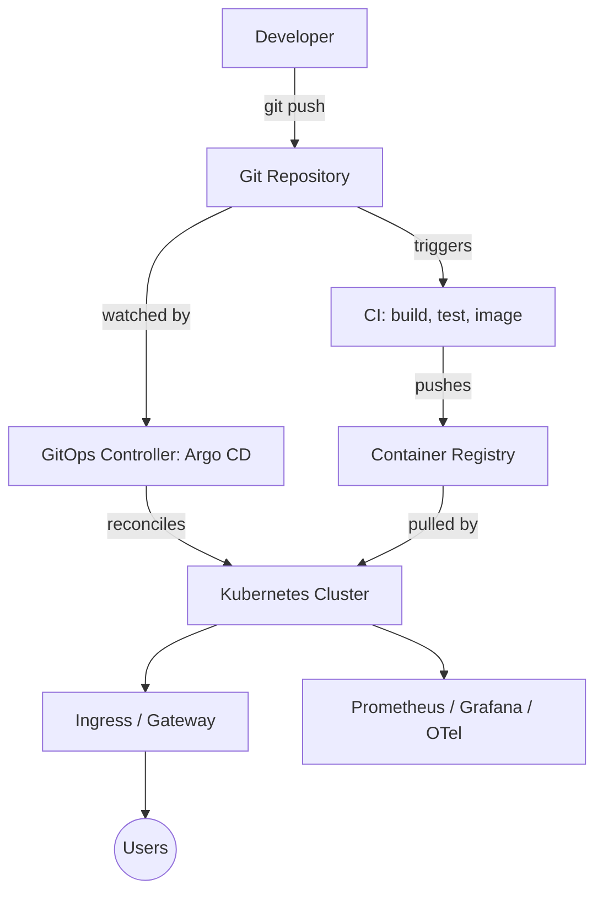
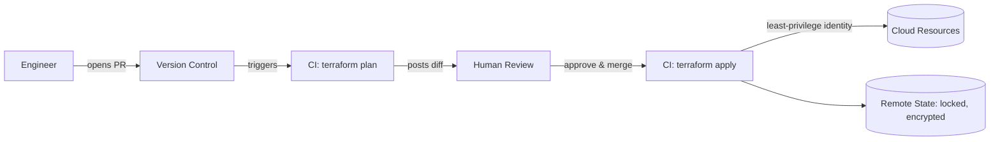
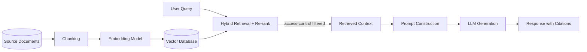
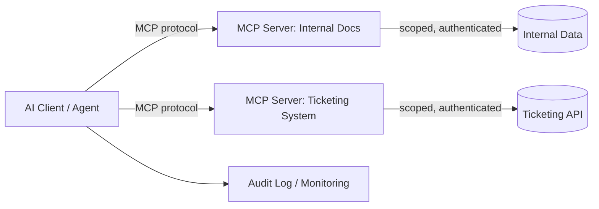

# Diagrams

**Label:** `Reference Architecture`

Simple, professional diagrams supporting the whiteboard interview framework ([`docs/architecture-interview-framework.md`](../docs/architecture-interview-framework.md)). Mermaid diagrams render natively in GitHub; draw.io files can be opened at [app.diagrams.net](https://app.diagrams.net) or the draw.io desktop app.

## Mermaid Diagrams (inline, GitHub-renderable)

- Enterprise cloud landing zone — see below
- Hub-spoke network topology — see below
- Kubernetes platform architecture — see below
- Terraform enterprise workflow — see below
- RAG pipeline — see below
- MCP architecture — see below

## draw.io Files

- [`architecture-interview-framework.drawio`](architecture-interview-framework.drawio) — the 13-step whiteboard method as a visual flow
- [`cloud-architecture-interview.drawio`](cloud-architecture-interview.drawio) — generic 3-tier cloud architecture template
- [`system-design-framework.drawio`](system-design-framework.drawio) — the 10-point system design framework as a visual flow

---

## Enterprise Landing Zone (Mermaid)

## Hub-Spoke Network Topology (Mermaid)

## Kubernetes Platform Architecture (Mermaid)

## Terraform Enterprise Workflow (Mermaid)

## RAG Pipeline (Mermaid)

## MCP Architecture (Mermaid)

